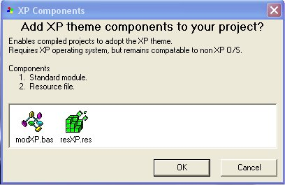



## XP Theme Add\-In

### Description

This Add-In provides an easy way for your project to adopt the XP theme. Two components are added to your project (standard module and a resource file) and once compiled your project will adopt the XP theme (on XP OS only) without the external manifest file. Once this add-in is built it's a piece of cake for anyone, even a novice, to create a project displaying the XP theme.

Although there are many examples on this subject, this is a unique way to add the necessary components to a project.
 
### More Info
 

             |
---                |---
**Submitted On**   |2005-11-22 16:18:10
**By**             |[Crock](https://github.com/Planet-Source-Code/PSCIndex/blob/master/ByAuthor/crock.md)
**Level**          |Advanced
**User Rating**    |4.5 (27 globes from 6 users)
**Compatibility**  |VB 6\.0
**Category**       |[Miscellaneous](https://github.com/Planet-Source-Code/PSCIndex/blob/master/ByCategory/miscellaneous__1-1.md)
**World**          |[Visual Basic](https://github.com/Planet-Source-Code/PSCIndex/blob/master/ByWorld/visual-basic.md)
**Archive File**   |[XP\_Theme\_A19506011232005\.zip](https://github.com/Planet-Source-Code/crock-xp-theme-add-in__1-63347/archive/master.zip)

